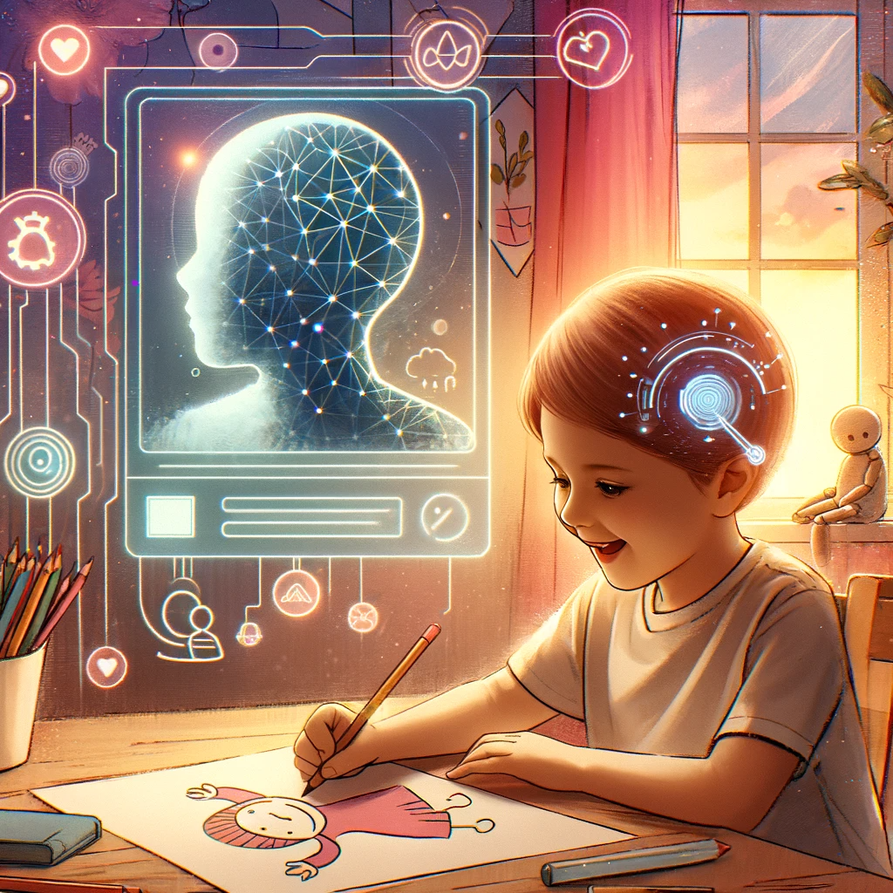

**In English**

**Intel future workforce program - OpenVino Project: AI-Based Child Drawing Psychological Diagnosis**

**Background**: Addresses the increasing cases of childhood depression and the challenges in early diagnosis and treatment.

**Objective**: Develop an AI system to analyze children's drawings for psychological assessment, offering an accessible and cost-effective solution for early detection of mental health issues.

**Methodology**: Utilize Convolutional Neural Networks (CNN) to interpret children's drawings, creating a user-friendly platform for parents and educators.

**Expected Outcome**: Enhance mental health care for children, providing a valuable tool for parents and professionals, leading to timely interventions and better mental health outcomes.

**In Korean**

**Intel future workforce program - OpenVino 프로젝트: 아동 그림을 통한 AI 기반 심리 진단**

**배경**: 아동 우울증 증가와 조기 진단 및 치료의 어려움에 대응.

**목표**: 아동의 그림을 분석하여 심리 평가를 수행하는 AI 시스템 개발, 접근성과 비용 효율적인 해결책 제공.

**방법론**: 아동의 그림을 해석하기 위해 컨볼루션 신경망(CNN)을 활용, 부모와 교육자를 위한 사용자 친화적 플랫폼 생성.

**기대 결과**: 아동의 정신 건강 관리 향상, 부모와 전문가를 위한 가치 있는 도구 제공, 적시적인 중재와 더 나은 정신 건강 결과 이끌어냄.
